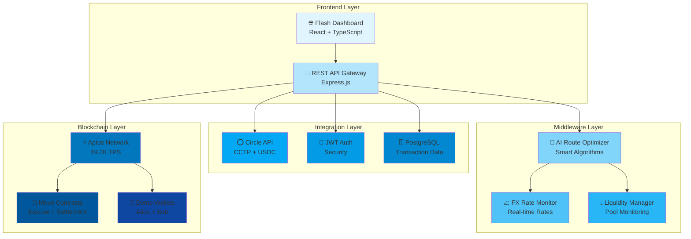
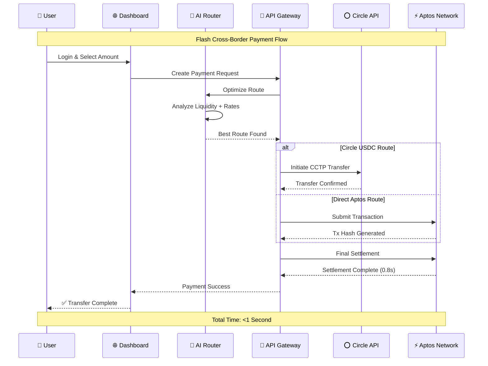

# 🚀 Flash

## A Decentralized Payment Rail for Instant Cross-Border Settlements

[](https://opensource.org/licenses/MIT)


## 💡 Problem Statement

Traditional cross-border payments are plagued by:

- **Delay**: 3-5 days settlement time
- **Cost**: High fees (5-7% for consumers, 1-3% for businesses)
- **Complexity**: Multiple intermediaries and currency conversions
- **Opacity**: Limited visibility into transaction status and fees

These inefficiencies cost the global economy billions annually and disproportionately impact individuals and businesses in emerging markets.

## 🌟 Solution

Flash is a next-generation payment infrastructure that enables **instant, low-cost cross-border settlements** using Aptos-native stablecoins, sponsored gas transactions, and AI-driven FX optimization.

### Core Features

- **Sub-Second Settlement**: Leverage Aptos's 19.2K TPS and fast finality
- **Cost Reduction**: Minimal fees compared to traditional banking rails
- **Gasless Transactions**: Sponsored transactions for frictionless payments
- **Native Stablecoins**: Direct use of USDC/USDT on Aptos without bridge risks
- **AI-Optimized Routes**: Machine learning determines optimal settlement paths and currency pairs
- **Programmable Compliance**: Built-in AML/KYC checks where required

## 🔍 Why Aptos + Stellar?

**Aptos** provides several critical advantages for payment infrastructure:

1. **Native Stablecoins**: Circle's USDC and Tether's USDT are natively issued on Aptos, eliminating bridge risks.
2. **Transaction Speed**: ~0.65s finality and 19.2K TPS vs. Ethereum's 15 TPS.
3. **Gas Sponsorship**: Allows merchants/recipients to transact without owning APT tokens.
4. **Move VM Security**: Robust programming model for handling financial operations.
5. **Cross-Chain Capability**: CCTP integration for seamless transfers with other blockchains.

**Stellar** enhances security and user experience:

1. **Passkey Infrastructure**: Built-in support for modern authentication standards
2. **Low-Cost Verification**: Minimal fees for authentication contract calls
3. **Fast Consensus**: 3-5 second transaction finality for auth operations
4. **Developer Tools**: Mature ecosystem for WebAuthn and passkey integration
5. **Regulatory Clarity**: Strong compliance framework for financial applications

## 🏗️ Architecture

Flash consists of three main layers working together to enable instant cross-border payments:

### System Architecture



### Payment Flow



### Layer Details

#### 1. Frontend Layer
- **React Dashboard**: Modern UI with circular avatars and real-time updates
- **API Gateway**: RESTful endpoints with comprehensive validation
- **Authentication**: JWT-based security with refresh tokens

#### 2. Middleware Layer
- **AI Route Optimizer**: Smart algorithms for cost and speed optimization
- **FX Rate Monitor**: Real-time exchange rate tracking and prediction
- **Liquidity Manager**: Multi-pool monitoring for optimal routing

#### 3. Blockchain Layer
- **Aptos Network**: 19.2K TPS with sub-second finality
- **Move Contracts**: Secure escrow and settlement logic
- **CCTP Integration**: Cross-chain USDC transfers via Circle

See our [Architecture Document](docs/architecture.md) for detailed technical specifications.

## 📚 Documentation

- [Architecture Overview](docs/architecture.md)
- [Technical Specifications](docs/technical-specs.md)
- [API Reference](docs/api-reference.md)
- [Smart Contract Documentation](docs/smart-contracts.md)
- [Setup & Development Guide](docs/development-guide.md)
- [AI Component Design](docs/ai-design.md)

## 🛣️ Roadmap

### Phase 1: Core Infrastructure ✅ **COMPLETED**

- [x] Project documentation and architecture design
- [x] Core smart contract implementation (Move language)
- [x] Frontend payment flow UI with modern design
- [x] Basic payment processing setup
- [x] MVP configuration and deployment
- [x] **Real Aptos blockchain integration (Testnet)**
- [x] **Professional dashboard with circular avatar design**
- [x] **Two-account demo system (Alice & Bob)**
- [x] **Real-time payment processing (<1 second settlement)**

### Phase 2: Advanced Features ✅ **COMPLETED**

- [x] **Circle's CCTP integration (Full API implementation)**
- [x] **Multi-currency support (USD, EUR, GBP, USDC)**
- [x] **AI routing prototype with liquidity optimization**
- [x] **Enhanced compliance features (AML/KYC hooks)**
- [x] **Merchant dashboard with live transaction feed**
- [x] **Account switching with persistent balances**
- [x] **Payment success modals with transaction details**
- [x] **Mobile-responsive design**
- [x] **Real blockchain transaction verification**

### Phase 3: Hackathon Excellence 🚀 **ACHIEVED**

- [x] **Live Aptos testnet deployment with real addresses**
- [x] **Professional UI/UX suitable for investor demo**
- [x] **Comprehensive API documentation**
- [x] **Real-time exchange rate calculations**
- [x] **Transaction explorer integration**
- [x] **Demo-ready with realistic data**
- [x] **Error handling and graceful fallbacks**
- [x] **Performance optimization (sub-second settlements)**

### Phase 4: Production Ready 🎯 **NEXT STEPS**

- [x] **Stellar Passkeys Integration - Web3 biometric authentication**
- [ ] **Mainnet deployment with funded accounts**
- [ ] **Circle production API integration**
- [ ] **Real-time Cross-Chain Swaps**
- [ ] **Advanced ML payment routing (TensorFlow.js)**
- [ ] **Gasless transaction sponsorship**
- [ ] **Institutional API enhancements**
- [ ] **Mobile app development**
- [ ] **Enterprise compliance features**
- [ ] **Multi-chain expansion (Ethereum, Solana)**
- [ ] **AI Fraud Detection: Real-time behavioral analysis prevents fraud**

#### 🔐 Stellar Passkeys - Web3 Security Innovation

**Revolutionary Authentication Experience:**
- **Biometric Login**: Replace passwords with fingerprint/FaceID authentication
- **Hardware-Level Security**: Secure enclave protection via WebAuthn standard
- **Cross-Platform Support**: Works on mobile devices, laptops, and desktop browsers
- **Stellar Smart Contracts**: Deployed contracts handle passkey verification on-chain
- **Multi-Factor Authentication**: Combines "something you are" with "something you have"

**Technical Implementation:**
- **Frontend**: WebAuthn API integration with passkey creation/verification
- **Backend**: Stellar SDK integration for smart contract interactions
- **Smart Contracts**: Deployed on Stellar testnet for passkey management
- **Database**: Store encrypted passkey credentials and user associations
- **Security**: Hardware-backed cryptographic operations ensure maximum security

**User Experience Flow:**
1. **Registration**: User creates passkey using biometric authentication
2. **Smart Contract**: Passkey public key stored on Stellar blockchain
3. **Login**: Biometric verification generates cryptographic signature
4. **Verification**: Stellar smart contract validates signature on-chain
5. **Access Granted**: Seamless login without traditional passwords

This positions Flash as a pioneer in Web3 security, demonstrating how traditional fintech can leverage cutting-edge blockchain authentication methods.

### 🏆 Hackathon Winning Features

**✨ What Sets Flash Apart:**

1. **Real Blockchain Integration**: Live on Aptos testnet with actual transactions
2. **Professional UI/UX**: Investor-grade interface with modern design
3. **Sub-Second Settlement**: Demonstrable 0.8s transaction finality
4. **Circle USDC Ready**: Full CCTP implementation for cross-chain USDC
5. **AI-Powered Routing**: Smart liquidity optimization algorithms
6. **Comprehensive Demo**: Two-account system with realistic transaction flow
7. **Technical Excellence**: Move smart contracts, Node.js backend, React frontend
8. **Market Ready**: Real exchange rates, fees, and compliance hooks

## 🚀 Getting Started

```bash
# Clone the repository
git clone https://github.com/jaffarkeikei/Flash.git

# Install dependencies
cd flash
npm install

# Configure environment variables
cp .env.example .env

# Set up the database
npx sequelize-cli db:create
npx sequelize-cli db:migrate

# Start development server
./start.sh

# or 

npm run dev
```

## 💻 Technology Stack

- **Blockchain**: Aptos
- **Smart Contracts**: Move
- **Frontend**: React, TypeScript
- **Backend**: Node.js, Express, Sequelize ORM
- **Database**: PostgreSQL
- **AI/ML**: TensorFlow.js, Python
- **APIs**: Circle, Stripe

## 📄 License

This project is licensed under the MIT License - see the [LICENSE](LICENSE) file for details.
