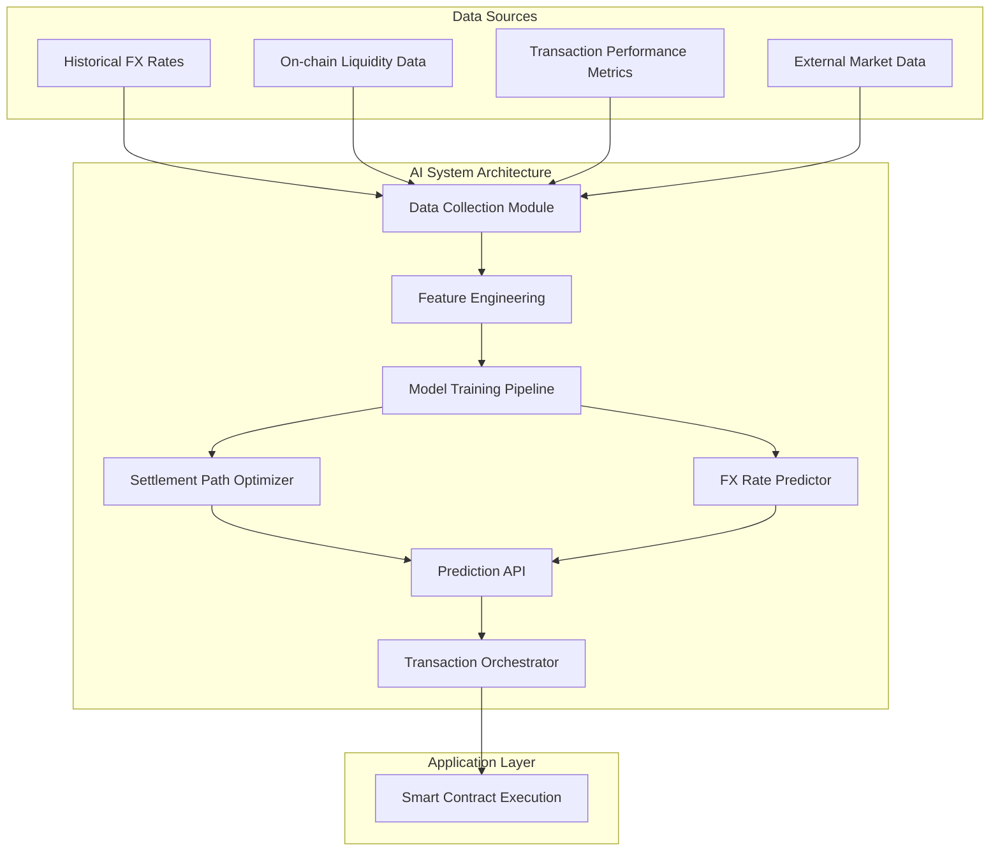
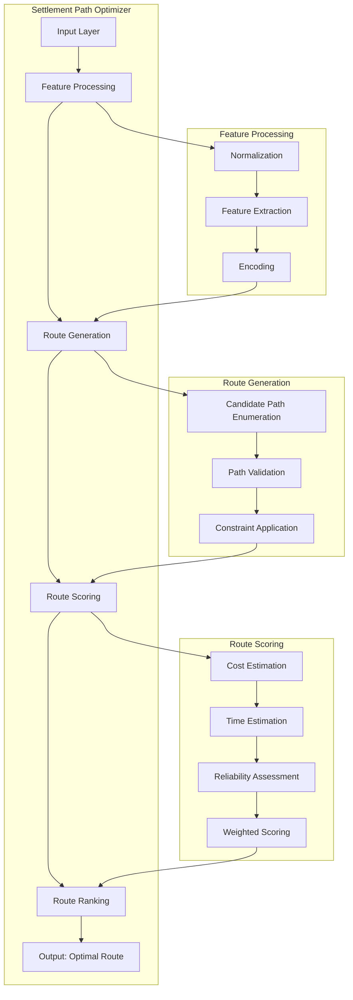
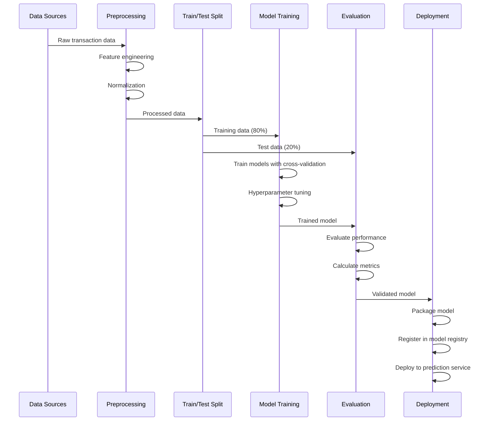
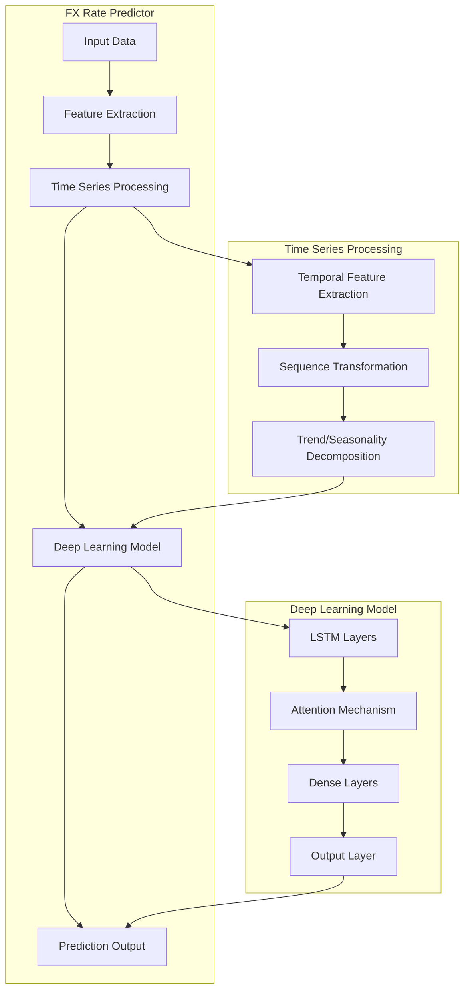
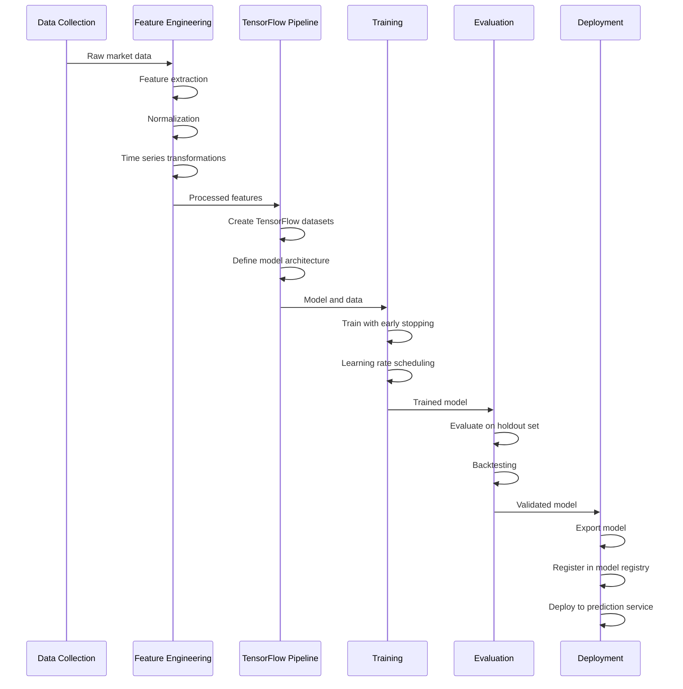
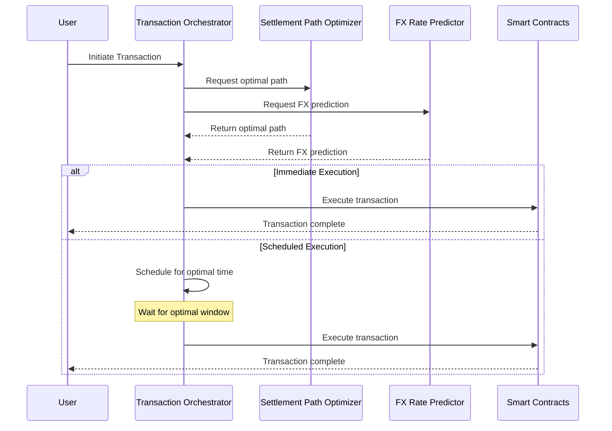
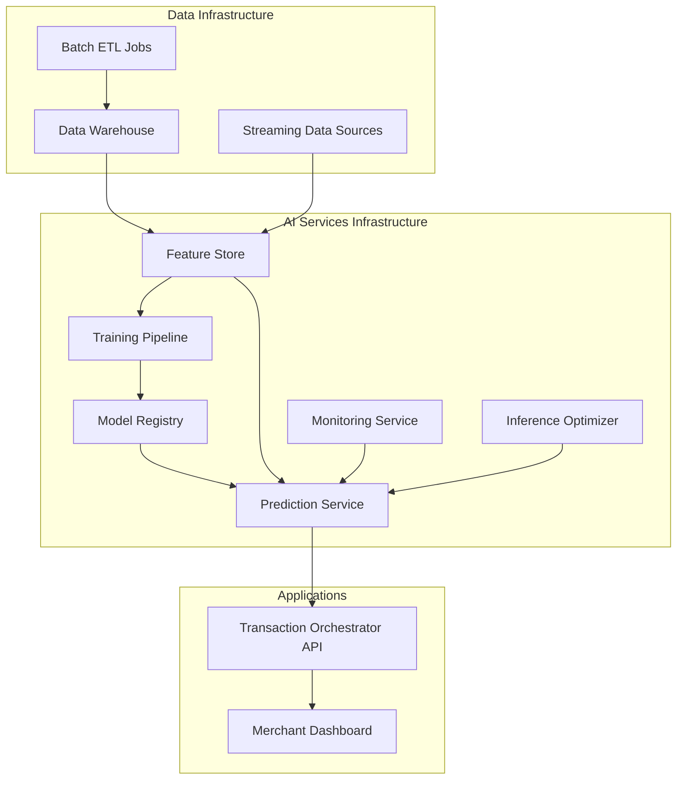
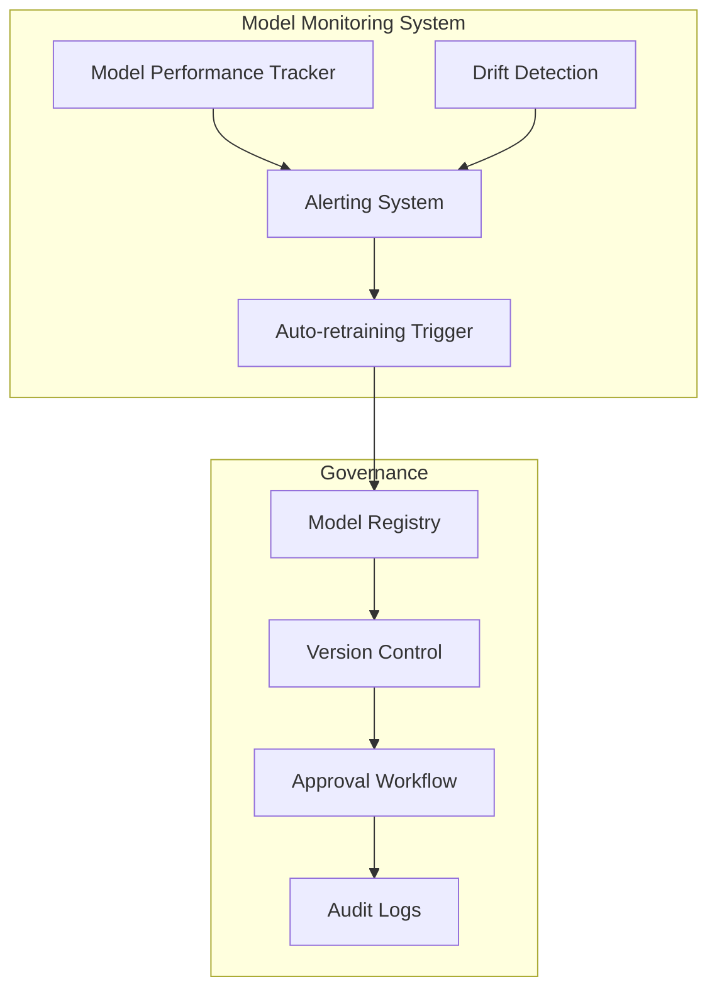

# AI Component Design

This document outlines the artificial intelligence components of the Aptos Flash platform, focusing on the settlement path optimizer and FX prediction capabilities.

## Overview

Flash leverages AI to optimize cross-border payments in two primary ways:

1. **Settlement Path Optimization**: Determining the most efficient route for funds to travel from sender to recipient
2. **FX Rate Prediction**: Forecasting exchange rate movements to identify optimal transaction timing

These AI-driven optimizations significantly improve the efficiency, cost, and speed of cross-border payments compared to traditional methods.

## Architecture



## Settlement Path Optimizer

The Settlement Path Optimizer determines the most efficient route for moving funds from the sender to the recipient, considering multiple factors to minimize cost and delivery time.

### Input Features

The optimizer considers the following inputs:

1. **Transaction Parameters**:
   - Amount
   - Source currency
   - Destination currency
   - Urgency (standard/express)

2. **Network State**:
   - Liquidity across different routes
   - Current gas prices
   - Historical congestion patterns
   - Bridge/settlement times

3. **Cost Factors**:
   - Exchange rates and slippage
   - Platform fees
   - Bridge fees
   - Gas costs

### Model Architecture



The optimizer uses a hybrid approach combining:

1. **Graph-Based Routing Algorithms**: Modified Dijkstra's algorithm for finding the shortest path in a weighted graph, where nodes are currencies and edges represent conversion options.

2. **Machine Learning Model**: A gradient-boosted decision tree model (e.g., XGBoost) for scoring and ranking candidate routes.

### Training Methodology



The model is trained using:

1. **Historical Transaction Data**: Actual cross-border payment transactions with their routes, costs, and delivery times.
2. **Simulated Scenarios**: Generated data representing edge cases and rare conditions.
3. **Reinforcement Learning**: The model improves over time by learning from the outcomes of its routing decisions.

### Performance Metrics

The optimizer's performance is evaluated using:

1. **Cost Reduction**: Percentage savings compared to baseline routes
2. **Time Efficiency**: Reduction in settlement time
3. **Success Rate**: Percentage of transactions that complete successfully
4. **Prediction Accuracy**: How closely actual costs/times match predictions

Current performance:
- Average cost reduction: 0.4-1.2% compared to naive routing
- Average time savings: 22-35 seconds per transaction
- Success rate improvement: 0.3% higher than baseline routing

### Example Output

```json
{
  "transaction_id": "txn_2023051200112",
  "source": {
    "currency": "USD",
    "amount": 1000.00
  },
  "destination": {
    "currency": "BRL",
    "estimated_amount": 4985.25
  },
  "optimal_route": {
    "path": [
      {
        "stage": 1,
        "from": "USD",
        "to": "USDC",
        "platform": "Circle",
        "estimated_time_seconds": 15,
        "estimated_fee": 0.50
      },
      {
        "stage": 2,
        "from": "USDC",
        "to": "USDC",
        "platform": "Aptos Network",
        "estimated_time_seconds": 0.65,
        "estimated_fee": 0.001
      },
      {
        "stage": 3,
        "from": "USDC",
        "to": "BRL",
        "platform": "LocalPartnerExchange",
        "estimated_time_seconds": 5,
        "estimated_fee": 2.50
      }
    ],
    "total_estimated_time_seconds": 20.65,
    "total_estimated_fee_usd": 3.001,
    "confidence_score": 0.97
  },
  "alternatives": [
    {
      "route_id": "route_2",
      "total_estimated_time_seconds": 35.5,
      "total_estimated_fee_usd": 2.85,
      "confidence_score": 0.92,
      "reason_not_selected": "slower_settlement"
    },
    {
      "route_id": "route_3",
      "total_estimated_time_seconds": 18.2,
      "total_estimated_fee_usd": 4.75,
      "confidence_score": 0.88,
      "reason_not_selected": "higher_cost"
    }
  ]
}
```

## FX Rate Predictor

The FX Rate Predictor forecasts short-term currency movements to identify optimal timing for cross-border payments, helping to minimize FX costs.

### Input Features

The predictor uses the following data:

1. **Time Series Data**:
   - Historical exchange rates (multiple timeframes)
   - Trading volume
   - Volatility metrics

2. **Market Indicators**:
   - Interest rate differentials
   - Economic indicators
   - Market sentiment indicators

3. **On-chain Data**:
   - Liquidity pool imbalances
   - Trading volumes on DEXs
   - Stablecoin premiums/discounts

### Model Architecture



The FX Rate Predictor uses a hybrid model combining:

1. **LSTM Neural Network**: To capture temporal patterns in currency movements
2. **Attention Mechanism**: To focus on the most relevant time periods
3. **Gradient Boosting**: For incorporating non-sequential features

### Training Process



The model training process includes:

1. **Data Collection**: Gathering historical FX data from multiple sources
2. **Feature Engineering**: Creating relevant features and transformations
3. **Model Training**: Using TensorFlow with appropriate regularization
4. **Backtesting**: Evaluating model performance on historical data
5. **Continuous Learning**: Regularly updating the model with new data

### Prediction Windows

The model provides predictions at different time horizons:

1. **Short-term (1-15 minutes)**: For immediate transaction decisions
2. **Medium-term (1-4 hours)**: For batched transactions planning
3. **Long-term (1-3 days)**: For strategic treasury operations

### Performance Metrics

The predictor's performance is evaluated using:

1. **Mean Absolute Percentage Error (MAPE)**: For accuracy in magnitude
2. **Directional Accuracy**: For correctly predicting up/down movements
3. **Economic Value Added**: Actual savings generated through timing optimization

Current performance:
- MAPE (15-minute horizon): 0.08-0.12%
- Directional accuracy: 57-63%
- Average cost savings: 0.15-0.3% per transaction

### Implementation Details

The model is implemented using TensorFlow and deployed as a microservice that provides:

1. **Real-time predictions**: REST API for on-demand prediction requests
2. **Streaming updates**: Websocket connection for continuous prediction updates
3. **Batch prediction**: For planning future transactions

## Integration with Transaction Orchestrator



The AI components integrate with the rest of the Flash platform as follows:

1. **Transaction Initiation**: When a new payment is created, the Transaction Orchestrator requests predictions from the AI services.

2. **Decision Making**: The orchestrator combines the outputs from both AI models to make decisions:
   - Which path to use for routing the payment
   - Whether to execute immediately or wait for a better FX rate
   - How to split large payments for optimal execution

3. **Feedback Loop**: Transaction outcomes are recorded and fed back into the training data to continuously improve the models.

## Deployment Architecture



The AI systems are deployed using:

1. **Containerization**: Docker containers for all AI services
2. **Orchestration**: Kubernetes for managing the containerized services
3. **Auto-scaling**: Dynamic scaling based on load to maintain prediction latency
4. **Redundancy**: Multiple instances across availability zones

### Prediction Service SLAs

The AI services are designed to meet the following service level agreements:

1. **Latency**: 
   - 95th percentile < 100ms for path optimization
   - 99th percentile < 200ms for path optimization

2. **Availability**: 
   - 99.9% uptime for prediction services
   - Graceful degradation to fallback models in case of issues

3. **Throughput**:
   - Capable of handling 1000+ prediction requests per second

## Future AI Enhancements

Future improvements to the AI components include:

1. **Reinforcement Learning**: Moving beyond supervised learning to RL approaches that can better optimize for long-term outcomes

2. **Multi-objective Optimization**: Balancing cost, speed, reliability, and other factors based on user preferences

3. **Anomaly Detection**: Advanced anomaly detection to identify suspicious transactions and potential fraud

4. **Personalization**: User-specific optimization based on historical preferences and behavior

5. **Market Impact Modeling**: For large transactions, modeling the market impact to minimize slippage

## Model Monitoring and Governance



The AI components include comprehensive monitoring and governance:

1. **Performance Monitoring**: Tracking key metrics in real-time to detect degradation
2. **Data and Model Drift Detection**: Identifying when the input data distribution or model behavior changes
3. **Automatic Retraining**: Triggering model retraining when performance drops below thresholds
4. **Versioning and Rollback**: Maintaining a history of model versions with the ability to roll back
5. **A/B Testing**: Systematically testing model improvements before full deployment

## Conclusion

The AI components of Flash represent a significant advancement in cross-border payment optimization, leveraging the speed and efficiency of the Aptos blockchain combined with sophisticated machine learning techniques. By continuously learning and improving from transaction data, the system provides increasingly efficient payment routing and timing, creating a superior experience for users while minimizing costs.

Future iterations will further enhance these capabilities, making cross-border payments even more seamless and cost-effective through the power of AI-optimized blockchain technology. 