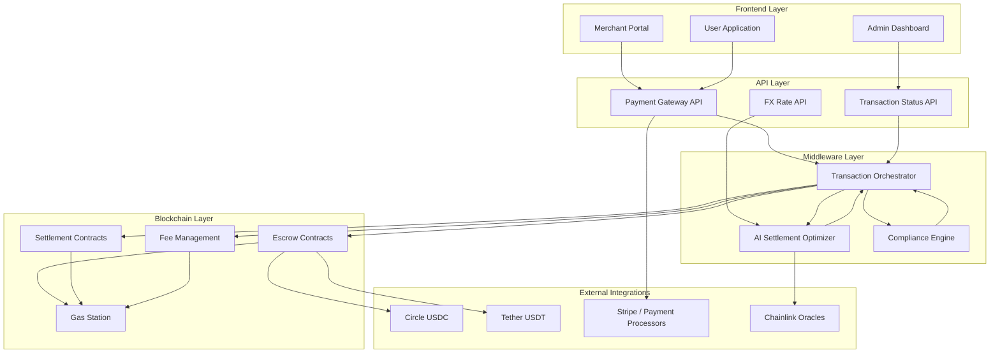
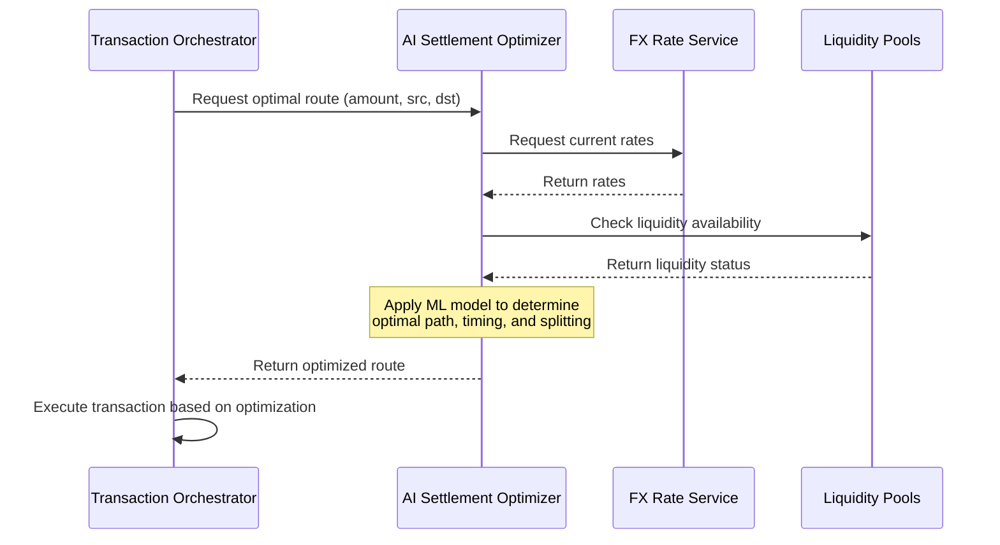
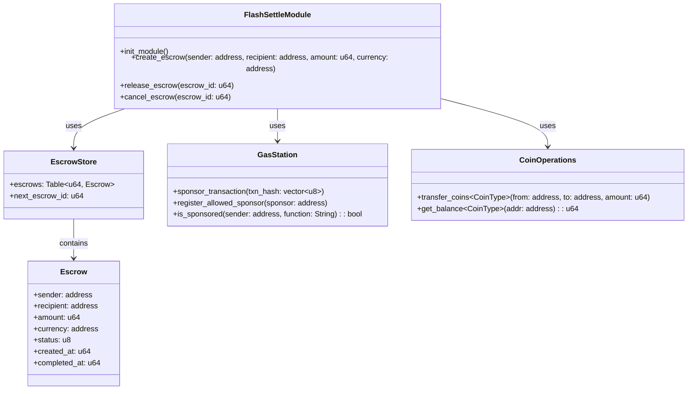
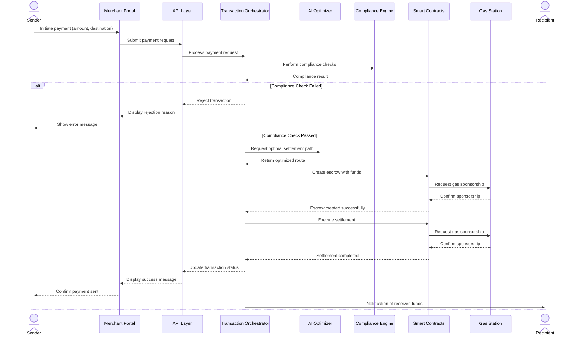
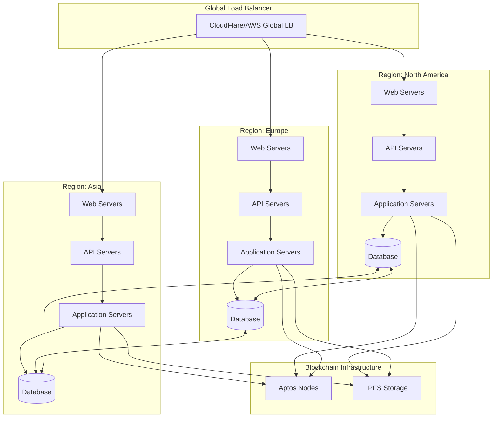

# Aptos FlashSettle: Architecture Overview

## System Architecture

FlashSettle employs a multi-layered architecture designed for security, speed, and scalability. The system orchestrates interactions between traditional financial systems and blockchain-based settlement rails, with AI optimization for efficiency.

## Component Breakdown

### 1. Frontend Layer

The Frontend Layer provides interfaces for different user types:

- **Merchant Portal**: For businesses to initiate and monitor payments
- **User Application**: For individual senders/receivers to manage transfers
- **Admin Dashboard**: For system administrators to oversee operations

#### Key Interactions:
- Initiates payment requests and authentication
- Displays real-time transaction status
- Manages user profiles and payment history
- Provides analytics and reporting capabilities

### 2. API Layer

The API Layer exposes services to frontend applications and external integrations:

- **Payment Gateway API**: Handles payment initialization, validation, and processing
- **FX Rate API**: Provides current and historical exchange rates
- **Transaction Status API**: Reports on the status of in-flight transactions

#### API Specifications:

| Endpoint | Method | Description | Parameters | Response |
|----------|--------|-------------|------------|----------|
| `/api/v1/payments` | POST | Initiate a new payment | `amount`, `sourceCurrency`, `targetCurrency`, `recipient` | Payment ID, status |
| `/api/v1/rates` | GET | Get current exchange rates | `sourceCurrency`, `targetCurrency` | Rate, timestamp |
| `/api/v1/payments/:id` | GET | Get payment status | `id` | Payment details, status |

### 3. Middleware Layer

The Middleware Layer contains the core business logic that orchestrates the payment flow:

- **AI Settlement Optimizer**: Uses machine learning to determine the most efficient routing and timing
- **Compliance Engine**: Ensures transactions meet regulatory requirements
- **Transaction Orchestrator**: Coordinates the end-to-end payment flow

#### AI Optimizer Workflow

### 4. Blockchain Layer

The Blockchain Layer handles the on-chain components of the system:

- **Escrow Contracts**: Securely hold funds during the transaction process
- **Settlement Contracts**: Execute the final transfer to recipients
- **Fee Management**: Calculates and distributes fees to relevant parties
- **Gas Station**: Manages sponsored transactions for gasless user experience

#### Smart Contract Architecture

### 5. External Integrations

FlashSettle connects with various external systems:

- **Circle USDC**: Native USDC integration on Aptos
- **Tether USDT**: Native USDT integration on Aptos
- **Stripe / Payment Processors**: For fiat on/off ramping
- **Chainlink Oracles**: For reliable FX rate data

## Transaction Flow

The following sequence diagram illustrates the end-to-end flow for a typical cross-border payment:

## Deployment Architecture

FlashSettle is designed to be deployed across multiple regions for optimal performance and reliability:

## Security Considerations

Security is paramount in financial applications. FlashSettle implements multiple layers of protection:

1. **Smart Contract Security**:
   - Formal verification of critical functions
   - Limited access control via capability pattern
   - Comprehensive unit and integration testing

2. **Transaction Security**:
   - Multi-factor authentication for all payment initiations
   - Fraud detection using ML-based anomaly detection
   - Rate limiting to prevent abuse

3. **Data Security**:
   - End-to-end encryption for all sensitive data
   - Minimal on-chain data storage
   - Compliance with data protection regulations (GDPR, CCPA)

4. **Infrastructure Security**:
   - DDoS protection
   - Regular security audits
   - Disaster recovery planning

## Performance Considerations

FlashSettle is designed to handle high transaction volumes with consistent performance:

- **Blockchain Layer**: Leverages Aptos's 19.2K TPS and sub-second finality
- **API Layer**: Horizontally scalable, load-balanced API servers
- **Database Layer**: Sharded databases with read replicas for query-heavy operations
- **Caching Layer**: Distributed caching for frequently accessed data
- **Global CDN**: Edge-cached static content for minimal latency

## Conclusion

The FlashSettle architecture delivers a robust, secure, and efficient platform for cross-border payments. By leveraging Aptos's native features combined with advanced AI optimization, the system provides significant advantages over traditional payment rails in terms of speed, cost, and user experience.

Next steps include detailed implementation of each component, comprehensive testing, and iterative improvements based on user feedback. 