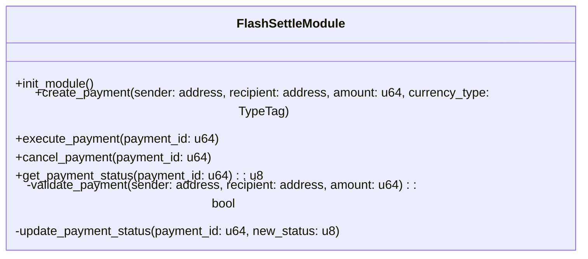
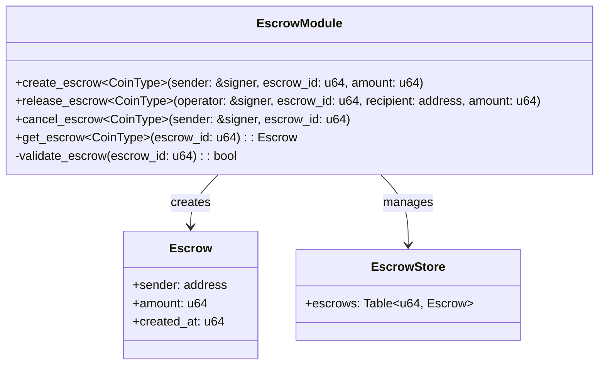
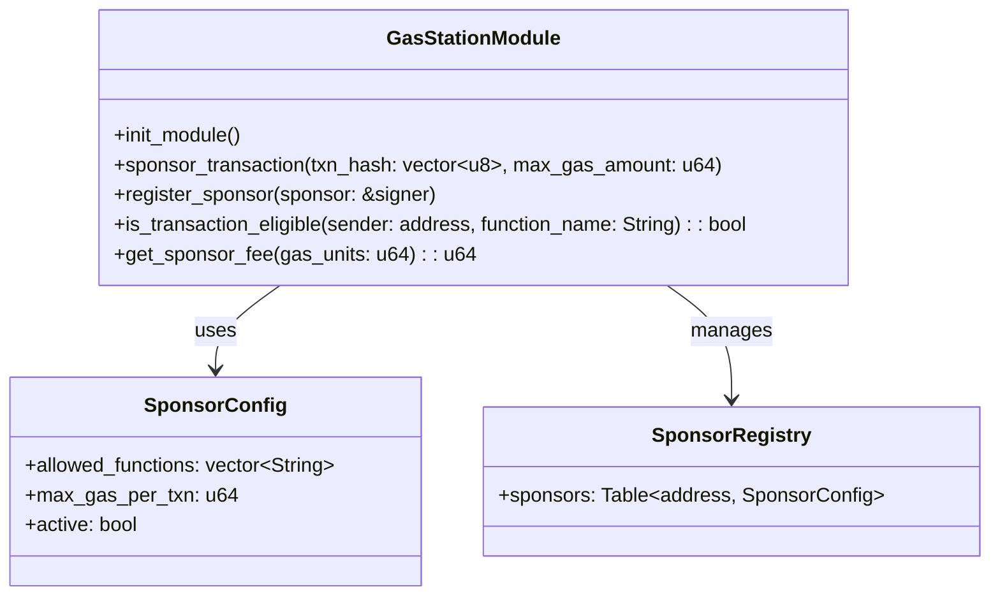
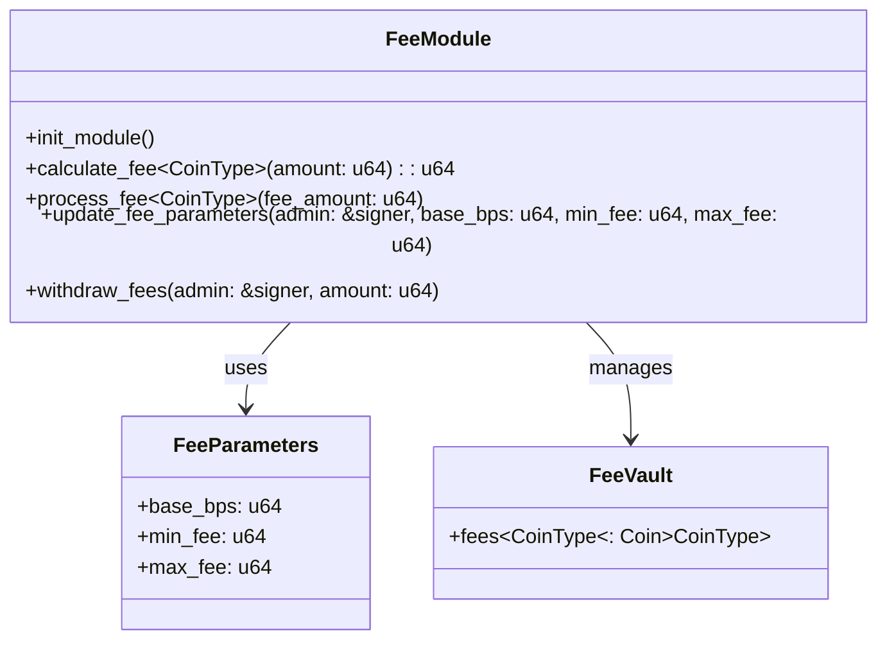
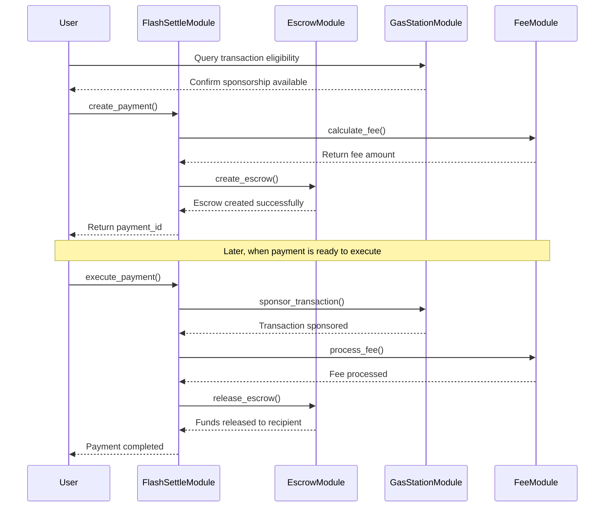
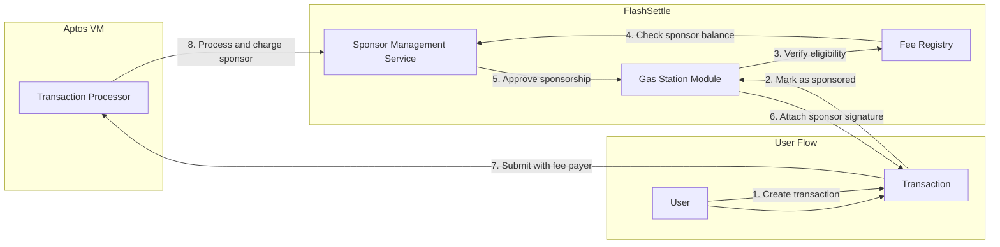

# Smart Contract Documentation

This document details the Move smart contracts that power the Aptos FlashSettle platform. These contracts handle the on-chain components of cross-border payments, including escrow, settlement, and gas sponsorship.

## Contract Overview

The FlashSettle system consists of four primary smart contract modules:

1. **FlashSettleModule**: Main module that handles payment creation, execution, and management
2. **EscrowModule**: Manages secure fund holding during the settlement process
3. **GasStationModule**: Provides gas sponsorship for a gasless user experience
4. **FeeModule**: Handles fee calculation and distribution

## Module Architecture

### FlashSettleModule



The FlashSettleModule serves as the main entry point for creating and managing cross-border payments. It coordinates between the other modules to execute end-to-end payment flows.

```move
module flashsettle::flashsettle_module {
    use std::signer;
    use std::string::{String};
    use aptos_framework::coin::{Self, Coin};
    use aptos_framework::timestamp;
    use aptos_framework::account;
    use flashsettle::escrow_module;
    use flashsettle::gas_station_module;
    use flashsettle::fee_module;

    // Error codes
    const ENOT_AUTHORIZED: u64 = 1;
    const EINVALID_AMOUNT: u64 = 2;
    const EPAYMENT_ALREADY_PROCESSED: u64 = 3;
    const EPAYMENT_NOT_FOUND: u64 = 4;
    
    // Payment status codes
    const STATUS_CREATED: u8 = 0;
    const STATUS_PROCESSING: u8 = 1;
    const STATUS_COMPLETED: u8 = 2;
    const STATUS_CANCELLED: u8 = 3;
    const STATUS_FAILED: u8 = 4;
    
    struct Payment has key, store {
        id: u64,
        sender: address,
        recipient: address,
        amount: u64,
        fee: u64,
        currency_type: String,
        status: u8,
        created_at: u64,
        updated_at: u64
    }
    
    struct PaymentStore has key {
        payments: Table<u64, Payment>,
        next_payment_id: u64
    }
    
    public fun create_payment<CoinType>(
        sender: &signer,
        recipient: address,
        amount: u64
    ): u64 acquires PaymentStore {
        let sender_addr = signer::address_of(sender);
        
        // Validate the payment
        assert!(amount > 0, EINVALID_AMOUNT);
        
        // Calculate the fee
        let fee = fee_module::calculate_fee<CoinType>(amount);
        
        // Create payment record
        let payment_store = borrow_global_mut<PaymentStore>(@flashsettle);
        let payment_id = payment_store.next_payment_id;
        payment_store.next_payment_id = payment_id + 1;
        
        let currency_type = type_info::type_name<CoinType>();
        
        let payment = Payment {
            id: payment_id,
            sender: sender_addr,
            recipient,
            amount,
            fee,
            currency_type,
            status: STATUS_CREATED,
            created_at: timestamp::now_seconds(),
            updated_at: timestamp::now_seconds()
        };
        
        table::add(&mut payment_store.payments, payment_id, payment);
        
        // Transfer funds to escrow
        let total_amount = amount + fee;
        escrow_module::create_escrow<CoinType>(sender, payment_id, total_amount);
        
        payment_id
    }
    
    public fun execute_payment<CoinType>(
        operator: &signer,
        payment_id: u64
    ) acquires PaymentStore {
        // Authorization check
        let operator_addr = signer::address_of(operator);
        assert!(operator_addr == @flashsettle, ENOT_AUTHORIZED);
        
        // Get payment
        let payment_store = borrow_global_mut<PaymentStore>(@flashsettle);
        assert!(table::contains(&payment_store.payments, payment_id), EPAYMENT_NOT_FOUND);
        
        let payment = table::borrow_mut(&mut payment_store.payments, payment_id);
        assert!(payment.status == STATUS_CREATED, EPAYMENT_ALREADY_PROCESSED);
        
        // Update status
        payment.status = STATUS_PROCESSING;
        payment.updated_at = timestamp::now_seconds();
        
        // Process fee
        fee_module::process_fee<CoinType>(payment.fee);
        
        // Release from escrow to recipient
        escrow_module::release_escrow<CoinType>(operator, payment_id, payment.recipient, payment.amount);
        
        // Update status to completed
        payment.status = STATUS_COMPLETED;
        payment.updated_at = timestamp::now_seconds();
    }
    
    public fun cancel_payment<CoinType>(
        sender: &signer,
        payment_id: u64
    ) acquires PaymentStore {
        let sender_addr = signer::address_of(sender);
        
        // Get payment
        let payment_store = borrow_global_mut<PaymentStore>(@flashsettle);
        assert!(table::contains(&payment_store.payments, payment_id), EPAYMENT_NOT_FOUND);
        
        let payment = table::borrow_mut(&mut payment_store.payments, payment_id);
        
        // Authorization check
        assert!(payment.sender == sender_addr, ENOT_AUTHORIZED);
        assert!(payment.status == STATUS_CREATED, EPAYMENT_ALREADY_PROCESSED);
        
        // Update status
        payment.status = STATUS_CANCELLED;
        payment.updated_at = timestamp::now_seconds();
        
        // Return funds from escrow
        escrow_module::cancel_escrow<CoinType>(sender, payment_id);
    }
    
    // Additional functions...
}
```

### EscrowModule



The EscrowModule securely holds funds during the payment process, ensuring they are only released to the intended recipient upon successful settlement.

```move
module flashsettle::escrow_module {
    use std::signer;
    use aptos_framework::coin::{Self, Coin};
    use aptos_framework::timestamp;
    use aptos_framework::account;
    
    // Error codes
    const ENOT_AUTHORIZED: u64 = 1;
    const EESCROW_NOT_FOUND: u64 = 2;
    const EINSUFFICIENT_FUNDS: u64 = 3;
    
    struct Escrow has store {
        sender: address,
        amount: u64,
        created_at: u64
    }
    
    struct EscrowStore<phantom CoinType> has key {
        escrows: Table<u64, Escrow>,
        coins: Coin<CoinType>
    }
    
    public fun create_escrow<CoinType>(
        sender: &signer,
        escrow_id: u64,
        amount: u64
    ) {
        let sender_addr = signer::address_of(sender);
        
        // Verify sender has sufficient funds
        assert!(coin::balance<CoinType>(sender_addr) >= amount, EINSUFFICIENT_FUNDS);
        
        // Initialize store if needed
        if (!exists<EscrowStore<CoinType>>(@flashsettle)) {
            move_to(@flashsettle, EscrowStore<CoinType> {
                escrows: table::new(),
                coins: coin::zero<CoinType>()
            });
        };
        
        // Transfer funds to escrow
        let escrow_coins = coin::withdraw<CoinType>(sender, amount);
        let escrow_store = borrow_global_mut<EscrowStore<CoinType>>(@flashsettle);
        coin::merge(&mut escrow_store.coins, escrow_coins);
        
        // Create escrow record
        let escrow = Escrow {
            sender: sender_addr,
            amount,
            created_at: timestamp::now_seconds()
        };
        
        table::add(&mut escrow_store.escrows, escrow_id, escrow);
    }
    
    public fun release_escrow<CoinType>(
        operator: &signer,
        escrow_id: u64,
        recipient: address,
        amount: u64
    ) {
        let operator_addr = signer::address_of(operator);
        assert!(operator_addr == @flashsettle, ENOT_AUTHORIZED);
        
        let escrow_store = borrow_global_mut<EscrowStore<CoinType>>(@flashsettle);
        assert!(table::contains(&escrow_store.escrows, escrow_id), EESCROW_NOT_FOUND);
        
        let escrow = table::borrow(&escrow_store.escrows, escrow_id);
        assert!(escrow.amount >= amount, EINSUFFICIENT_FUNDS);
        
        // Transfer funds to recipient
        let recipient_coins = coin::extract(&mut escrow_store.coins, amount);
        coin::deposit(recipient, recipient_coins);
        
        // Update or remove escrow record
        if (escrow.amount == amount) {
            table::remove(&mut escrow_store.escrows, escrow_id);
        } else {
            let escrow_mut = table::borrow_mut(&mut escrow_store.escrows, escrow_id);
            escrow_mut.amount = escrow_mut.amount - amount;
        }
    }
    
    public fun cancel_escrow<CoinType>(
        sender: &signer,
        escrow_id: u64
    ) {
        let sender_addr = signer::address_of(sender);
        
        let escrow_store = borrow_global_mut<EscrowStore<CoinType>>(@flashsettle);
        assert!(table::contains(&escrow_store.escrows, escrow_id), EESCROW_NOT_FOUND);
        
        let escrow = table::borrow(&escrow_store.escrows, escrow_id);
        assert!(escrow.sender == sender_addr, ENOT_AUTHORIZED);
        
        // Return funds to sender
        let sender_coins = coin::extract(&mut escrow_store.coins, escrow.amount);
        coin::deposit(sender_addr, sender_coins);
        
        // Remove escrow record
        table::remove(&mut escrow_store.escrows, escrow_id);
    }
    
    // Additional functions...
}
```

### GasStationModule



The GasStationModule handles transaction fee sponsorship, allowing users to interact with the platform without needing to hold APT tokens for gas fees.

```move
module flashsettle::gas_station_module {
    use std::signer;
    use std::string::{String};
    use std::vector;
    use aptos_framework::account;
    use aptos_framework::coin;
    use aptos_framework::aptos_coin::AptosCoin;
    
    // Error codes
    const ENOT_AUTHORIZED: u64 = 1;
    const ESPONSOR_NOT_REGISTERED: u64 = 2;
    const EINSUFFICIENT_SPONSOR_BALANCE: u64 = 3;
    const ETRANSACTION_NOT_ELIGIBLE: u64 = 4;
    
    struct SponsorConfig has store {
        allowed_functions: vector<String>,
        max_gas_per_txn: u64,
        active: bool
    }
    
    struct SponsorRegistry has key {
        sponsors: Table<address, SponsorConfig>
    }
    
    struct SponsoredTxn has key {
        txn_hash: vector<u8>,
        sponsor: address,
        gas_amount: u64,
        processed: bool
    }
    
    public fun init_module(admin: &signer) {
        let admin_addr = signer::address_of(admin);
        assert!(admin_addr == @flashsettle, ENOT_AUTHORIZED);
        
        if (!exists<SponsorRegistry>(admin_addr)) {
            move_to(admin, SponsorRegistry {
                sponsors: table::new()
            });
        };
    }
    
    public fun register_sponsor(
        sponsor: &signer,
        allowed_functions: vector<String>,
        max_gas_per_txn: u64
    ) {
        let sponsor_addr = signer::address_of(sponsor);
        let registry = borrow_global_mut<SponsorRegistry>(@flashsettle);
        
        let sponsor_config = SponsorConfig {
            allowed_functions,
            max_gas_per_txn,
            active: true
        };
        
        if (table::contains(&registry.sponsors, sponsor_addr)) {
            table::remove(&mut registry.sponsors, sponsor_addr);
        };
        
        table::add(&mut registry.sponsors, sponsor_addr, sponsor_config);
    }
    
    public fun sponsor_transaction(
        sponsor: &signer,
        txn_hash: vector<u8>,
        sender: address,
        function_name: String,
        gas_units: u64
    ) {
        let sponsor_addr = signer::address_of(sponsor);
        
        // Verify sponsor is registered
        let registry = borrow_global<SponsorRegistry>(@flashsettle);
        assert!(table::contains(&registry.sponsors, sponsor_addr), ESPONSOR_NOT_REGISTERED);
        
        let sponsor_config = table::borrow(&registry.sponsors, sponsor_addr);
        assert!(sponsor_config.active, ESPONSOR_NOT_REGISTERED);
        
        // Verify function is eligible for sponsorship
        let is_eligible = false;
        let allowed_functions = &sponsor_config.allowed_functions;
        let len = vector::length(allowed_functions);
        let i = 0;
        while (i < len) {
            if (vector::borrow(allowed_functions, i) == &function_name) {
                is_eligible = true;
                break;
            };
            i = i + 1;
        };
        assert!(is_eligible, ETRANSACTION_NOT_ELIGIBLE);
        
        // Verify gas amount is within limits
        assert!(gas_units <= sponsor_config.max_gas_per_txn, ETRANSACTION_NOT_ELIGIBLE);
        
        // Verify sponsor has sufficient balance
        let gas_fee = gas_units * aptos_framework::gas_schedule::get_gas_unit_price();
        assert!(coin::balance<AptosCoin>(sponsor_addr) >= gas_fee, EINSUFFICIENT_SPONSOR_BALANCE);
        
        // Create sponsored transaction record
        move_to(sponsor, SponsoredTxn {
            txn_hash,
            sponsor: sponsor_addr,
            gas_amount: gas_fee,
            processed: false
        });
        
        // The actual fee payment is handled by the Aptos VM
    }
    
    public fun is_transaction_eligible(
        sender: address,
        function_name: String
    ): bool acquires SponsorRegistry {
        let registry = borrow_global<SponsorRegistry>(@flashsettle);
        let sponsors = &registry.sponsors;
        
        // Find a sponsor that will cover this transaction
        let sponsor_exists = false;
        let sponsor_addr = @0x0;
        
        let sponsors_iter = table::iter(sponsors);
        while (table::iter_has_next(&sponsors_iter)) {
            let (addr, config) = table::iter_next(&mut sponsors_iter);
            if (config.active) {
                let allowed_functions = &config.allowed_functions;
                let len = vector::length(allowed_functions);
                let i = 0;
                while (i < len) {
                    if (vector::borrow(allowed_functions, i) == &function_name) {
                        sponsor_exists = true;
                        sponsor_addr = addr;
                        break;
                    };
                    i = i + 1;
                };
                
                if (sponsor_exists) {
                    break;
                };
            };
        };
        
        if (!sponsor_exists) {
            return false
        };
        
        // Check if sponsor has sufficient balance
        // Implementation simplified for this example
        
        true
    }
    
    // Additional functions...
}
```

### FeeModule



The FeeModule handles the calculation and collection of transaction fees for the platform.

```move
module flashsettle::fee_module {
    use std::signer;
    use aptos_framework::coin::{Self, Coin};
    
    // Error codes
    const ENOT_AUTHORIZED: u64 = 1;
    const EINSUFFICIENT_FEES: u64 = 2;
    
    // Constants (basis points - 1/100 of 1%)
    const BASIS_POINTS_DENOMINATOR: u64 = 10000;
    
    struct FeeParameters has key {
        base_bps: u64,        // Base fee in basis points
        min_fee: u64,         // Minimum fee amount
        max_fee: u64          // Maximum fee amount
    }
    
    struct FeeVault<phantom CoinType> has key {
        coins: Coin<CoinType>
    }
    
    public fun init_module(admin: &signer) {
        let admin_addr = signer::address_of(admin);
        assert!(admin_addr == @flashsettle, ENOT_AUTHORIZED);
        
        // Default parameters: 0.5% fee with min $0.50 and max $50.00
        // Assuming the smallest unit is 1/1,000,000 of a token
        if (!exists<FeeParameters>(admin_addr)) {
            move_to(admin, FeeParameters {
                base_bps: 50,                  // 0.5%
                min_fee: 500000,               // $0.50
                max_fee: 50000000              // $50.00
            });
        };
    }
    
    public fun calculate_fee<CoinType>(amount: u64): u64 acquires FeeParameters {
        let fee_params = borrow_global<FeeParameters>(@flashsettle);
        
        // Calculate percentage-based fee
        let percentage_fee = (amount * fee_params.base_bps) / BASIS_POINTS_DENOMINATOR;
        
        // Apply min/max constraints
        if (percentage_fee < fee_params.min_fee) {
            percentage_fee = fee_params.min_fee;
        } else if (percentage_fee > fee_params.max_fee) {
            percentage_fee = fee_params.max_fee;
        };
        
        percentage_fee
    }
    
    public fun process_fee<CoinType>(
        sender: &signer,
        fee_amount: u64
    ) {
        let sender_addr = signer::address_of(sender);
        
        // Initialize fee vault if needed
        if (!exists<FeeVault<CoinType>>(@flashsettle)) {
            move_to(@flashsettle, FeeVault<CoinType> {
                coins: coin::zero<CoinType>()
            });
        };
        
        // Transfer fee to vault
        let fee_coins = coin::withdraw<CoinType>(sender, fee_amount);
        let fee_vault = borrow_global_mut<FeeVault<CoinType>>(@flashsettle);
        coin::merge(&mut fee_vault.coins, fee_coins);
    }
    
    public fun update_fee_parameters(
        admin: &signer,
        base_bps: u64,
        min_fee: u64,
        max_fee: u64
    ) acquires FeeParameters {
        let admin_addr = signer::address_of(admin);
        assert!(admin_addr == @flashsettle, ENOT_AUTHORIZED);
        
        let fee_params = borrow_global_mut<FeeParameters>(@flashsettle);
        fee_params.base_bps = base_bps;
        fee_params.min_fee = min_fee;
        fee_params.max_fee = max_fee;
    }
    
    public fun withdraw_fees<CoinType>(
        admin: &signer,
        amount: u64
    ) acquires FeeVault {
        let admin_addr = signer::address_of(admin);
        assert!(admin_addr == @flashsettle, ENOT_AUTHORIZED);
        
        let fee_vault = borrow_global_mut<FeeVault<CoinType>>(@flashsettle);
        let withdrawal_amount = if (amount == 0) {
            coin::value(&fee_vault.coins)
        } else {
            amount
        };
        
        assert!(coin::value(&fee_vault.coins) >= withdrawal_amount, EINSUFFICIENT_FEES);
        
        let withdrawal_coins = coin::extract(&mut fee_vault.coins, withdrawal_amount);
        coin::deposit(admin_addr, withdrawal_coins);
    }
    
    // Additional functions...
}
```

## Contract Integration Flow



## Gas Sponsorship Mechanism

The gas sponsorship feature in FlashSettle is a critical component for providing a seamless user experience, particularly for users who don't hold APT tokens or are new to the Aptos ecosystem.



### Implementation Details

The gas sponsorship works through Aptos's fee payer feature:

1. The user creates a transaction but doesn't sign the fee payer field
2. The FlashSettle backend service identifies the transaction as eligible for sponsorship
3. The service calls the `is_transaction_eligible` function to verify eligibility
4. If eligible, a sponsor account signs the transaction as a fee payer
5. The fully signed transaction is submitted to the Aptos blockchain
6. The sponsor's account is charged for gas fees instead of the user's account

### Fee Payer Implementation

```move
public entry fun create_sponsored_transaction(
    user_account: &signer,
    recipient: address,
    amount: u64,
    sponsor_account: &signer
) {
    // User signs the transaction payload
    let txn_payload = flashsettle_module::create_payment<USDC>(user_account, recipient, amount);
    
    // Sponsor signs as fee payer
    let sponsor_addr = signer::address_of(sponsor_account);
    
    // In a full implementation, this would be handled by the Aptos VM
    // For demonstration, we're simulating the fee payment
    let gas_fee = 100; // Simplified gas calculation
    
    // Simulate fee deduction
    let aptos_coins = coin::withdraw<AptosCoin>(sponsor_account, gas_fee);
    coin::deposit(@aptos_blockchain, aptos_coins);
    
    // Record the sponsorship
    gas_station_module::record_sponsorship(
        sponsor_account,
        txn_payload,
        gas_fee
    );
}
```

## Testing and Verification

### Unit Tests

Each module should include comprehensive unit tests to verify functionality:

```move
#[test]
fun test_create_and_execute_payment() {
    // Test setup
    let admin = account::create_account_for_test(@flashsettle);
    let sender = account::create_account_for_test(@0xA);
    let recipient = account::create_account_for_test(@0xB);
    
    // Initialize modules
    flashsettle_module::init_module(&admin);
    escrow_module::init_module(&admin);
    gas_station_module::init_module(&admin);
    fee_module::init_module(&admin);
    
    // Fund sender account
    let coins = coin::mint<USDC>(1000, &admin);
    coin::deposit(@0xA, coins);
    
    // Create payment
    let payment_id = flashsettle_module::create_payment<USDC>(
        &sender,
        @0xB,
        500
    );
    
    // Verify payment was created
    let status = flashsettle_module::get_payment_status(payment_id);
    assert!(status == 0, 0); // STATUS_CREATED
    
    // Execute payment
    flashsettle_module::execute_payment<USDC>(&admin, payment_id);
    
    // Verify payment was completed
    status = flashsettle_module::get_payment_status(payment_id);
    assert!(status == 2, 0); // STATUS_COMPLETED
    
    // Verify recipient received funds
    let recipient_balance = coin::balance<USDC>(@0xB);
    assert!(recipient_balance == 500, 0);
}
```

### Security Considerations

1. **Access Control**: Critical functions are protected by address-based authorization checks
2. **Fund Safety**: Escrow mechanism ensures funds are only released upon proper authorization
3. **Fee Management**: Transparent fee calculation with minimum and maximum bounds
4. **Gas Sponsorship Limits**: Controls in place to prevent abuse of sponsored transactions
5. **Error Handling**: Comprehensive error codes for predictable failure modes

## Future Enhancements

1. **Multi-Currency Support**: Enhanced support for various stablecoin types
2. **Advanced Compliance**: Integration with on-chain identity and compliance solutions
3. **Payment Batching**: Efficiency improvements for handling multiple payments
4. **Timelock Functions**: Enable setting expiration dates for unclaimed payments
5. **Dispute Resolution**: On-chain mechanisms for resolving payment disputes

## Contract Deployment

The FlashSettle contracts will be deployed to the Aptos mainnet at the following addresses:

- FlashSettleModule: `0x[TBD]`
- EscrowModule: `0x[TBD]`
- GasStationModule: `0x[TBD]`
- FeeModule: `0x[TBD]`

For hackathon demonstrations, testnet deployments will be provided. 